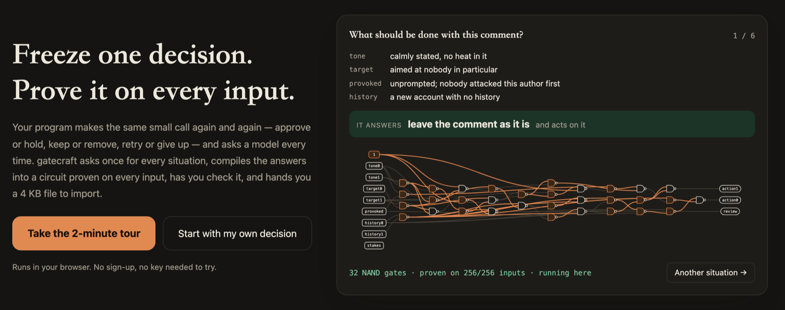
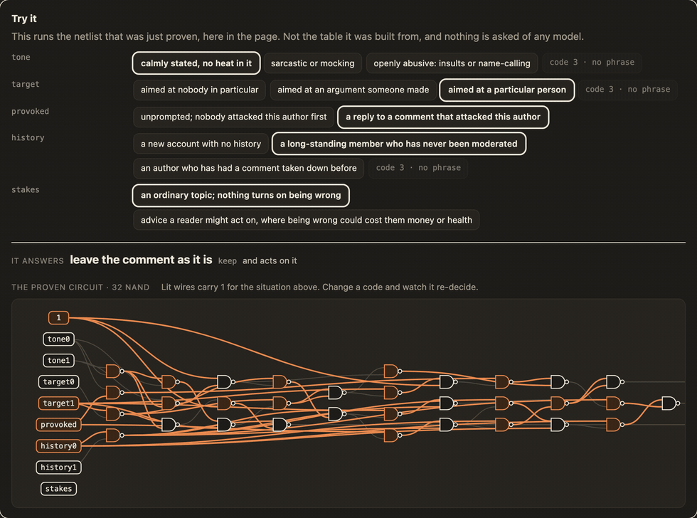
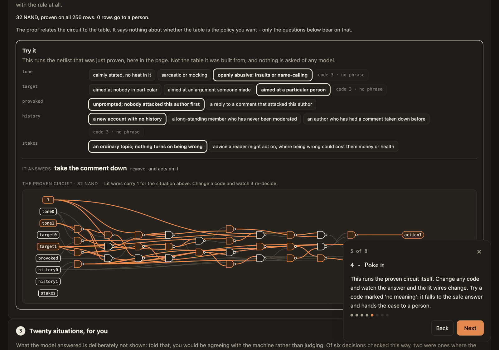
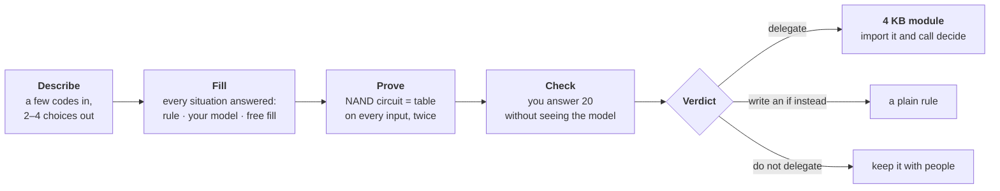
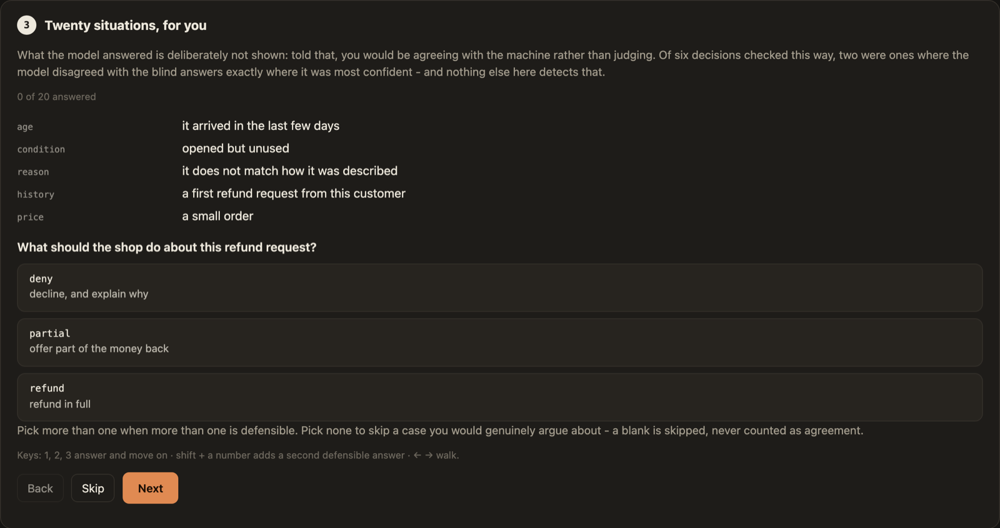
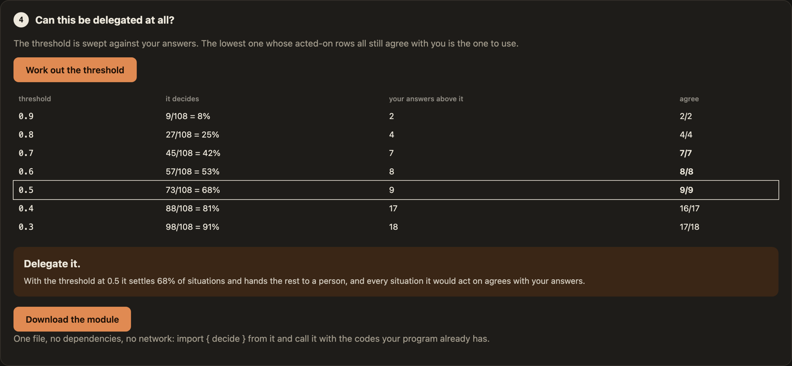

<div align="center">

# gatecraft

**Freeze one decision. Prove it on every input.**

[](https://gatecraft.fun)
[](LICENSE)


[](#use-it-from-your-agent-mcp)

English · [中文](README.zh-CN.md)



</div>

Your program makes the same small call again and again — approve or hold, keep or remove, retry or give up — and asks a language model every time. It answers differently about a quarter of the time, every call costs money, and nobody can say why it decided what it did.

**gatecraft asks once, for every situation your program can be in**, compiles the answers into a NAND circuit, proves the circuit on every input — twice, by two independent methods — has **you** check twenty of them blind, and hands you one file:

```js
import { decide } from "./refund-call.decision.mjs";   // 4 KB, no dependencies, no network

const { action, review } = decide({ age: 0, condition: 1, reason: 0, history: 0, price: 1 });
if (review) handToAPerson(); else actOn(action);
```

| | asking a model each time | frozen with gatecraft |
|---|---|---|
| Same input twice | a different answer **25%** of the time (measured) | always the same answer |
| Checked | never | every input, by two independent proofs |
| Cost per call | tokens, latency, an outage now and then | **nothing** — it is a table lookup |
| When it is unsure | answers anyway | **hands the case to a person** (`review: true`) |

## See it

Pick a situation and the proven circuit decides — the wires that carry 1 light up. A code nobody gave a meaning to falls to the safe answer and goes to a person, by construction:

<p align="center"></p>

## Try it

**In your browser** — [**gatecraft.fun**](https://gatecraft.fun). Nothing to install, no sign-up. Click **Take the 2-minute tour** and it walks you through a real decision, one step at a time.

<p align="center"></p>

**On your machine** — Node 20 or later, nothing to install:

```
git clone https://github.com/BruceLanLan/gatecraft && cd gatecraft
npm run ui                        # http://127.0.0.1:4747
```

**From your agent** — see [MCP](#use-it-from-your-agent-mcp) below.

## How it works



1. **Describe** the decision as a *codebook*: what it looks at, each as a few codes with a plain-language meaning, and the 2–4 things it can do. One of those is the **safe** choice — the least damaging if taken by mistake. A code with no meaning is illegal and always goes to a person. Don't want to write it? Describe the decision in one sentence and your own model drafts it.
2. **Fill** — every legal situation gets an answer (usually a few hundred).
3. **Prove** — the table is compiled to NAND gates and checked against the table on every input, then again by [Yosys](https://github.com/YosysHQ/yosys) with a miter and SAT.
4. **Check** — the proof says the circuit matches the table; only you can say the table is what you want. You answer twenty situations **without seeing the model's answers**:

   

5. **Verdict** — your answers sweep the confidence threshold and decide: **delegate** (at this threshold, it decides this share and hands the rest to a person), **write the rule instead** (an if-statement already does it), or **do not delegate**:

   

   *Above: refund-call, filled by the decision model and calibrated against 20 blind answers written before any of the model's answers had been looked at — by an AI acting as an independent judge, not yet by a person.*

6. **Ship** — download the module. It embeds the proven table and says in its header whether anyone checked it.

## Filling without a key

| | what you need | best for |
|---|---|---|
| **Free fills** | nothing — 3 per address, paid by the project | seeing the whole flow with the calibrated model |
| **A rule** | nothing — free and exact | a decision you can already write as an if (the verdict will usually say: do that) |
| **Your own model** | the model you set up in the page, or your agent over MCP | everyone, on their own account |
| **Jev** | a free [typesafe.ai](https://typesafe.ai) key, about 1 cent a decision | the best-calibrated confidence |

With your own model each situation is asked **three times** and the confidence is how often the answers agreed — a chat model's own confidence was measured to carry nothing, while unanimous rows reproduced 96–98% of the time. The call count is shown before you start. gatecraft never calls a model on its own and never bundles a key; the free fills are the one exception, forwarded by a small service at `trial.gatecraft.fun` that keeps only a hashed count per address (`GATECRAFT_TRIAL=off` turns it off). To use your own Jev key: `printf '%s' 'KEY' > ~/.config/gatecraft/jev.token`.

## Use it from your agent (MCP)

```
claude mcp add gatecraft -- node /path/to/gatecraft/scripts/mcp.mjs --out ./gatecraft-out
```

Other clients: `{ "mcpServers": { "gatecraft": { "command": "node", "args": ["/path/to/gatecraft/scripts/mcp.mjs", "--out", "./gatecraft-out"] } } }`. Then ask: *"freeze the auto-refund decision in our code with gatecraft."*

| tool | what it does |
|---|---|
| `gatecraft_decision_review` | reads a decision back in plain words, with what to check |
| `gatecraft_decision_situations` | lists every situation, so the agent can answer them |
| `gatecraft_decision_fill` | fills, freezes and proves — `rule`, `answers` (the agent's) or `jev` |
| `gatecraft_decision_anchors` | draws twenty questions **for you**, not the agent |
| `gatecraft_decision_calibrate` | sweeps the threshold against your answers |
| `gatecraft_decision_decide` | runs the proven circuit on one situation |
| `gatecraft_decision_export` | writes the module into your project |

The anchors are for a person: calibration records who answered, and an agent's answers are labelled a consistency check everywhere, including the module's header. The model's answers never pass through the agent's context — tools hand each other a directory, not the table. Nothing is written outside `--out`.

## Command line

```
node scripts/decide.mjs draft     --from "one sentence about the decision" --out out/d
node scripts/decide.mjs fill      --spec out/d/d.decision.json --with rule|chat|jev --out out/d
node scripts/decide.mjs freeze    --spec … --out out/d && node scripts/decide.mjs check --out out/d
node scripts/decide.mjs ask       --spec … --out out/d            # the twenty blind questions
node scripts/decide.mjs calibrate --spec … --out out/d --anchors out/d/anchors.answered.json
node scripts/decide.mjs export    --spec … --out out/d
```

## Is it for you?

**A good fit** when the same small decision runs many times; what it looks at is already a few categories (a tier, a status, a bucketed number); you can name the 2–4 things it can do; and being wrong one way is worse than the other.

**Not a fit** when it has to read text, recognise a person, check the time or call another service — bucketing raw values into codes is your program's job, and gatecraft does not cross that wall. Nor when it looks at so much (over 16 bits) that nobody could meaningfully spot-check twenty cases.

## What we measured

Every number above comes from a dated experiment, written up with the ones that went against us — [docs/findings.md](docs/findings.md). The short version:

- A model asked the same situation twice gave the same answer **75%** of the time.
- Scoring by agreement across three asks beat the model's own confidence on both decisions tested.
- Of 300 things people casually wished for, **3%** fit in a circuit — so gatecraft is for one decision inside a program, not "describe anything".
- Of 55 real decisions, **15%** fall where this pays off. Who needs it is not yet proven.
- In 2 of 6 decisions, the filling model disagreed with blind answers exactly where it was most confident, while every proof and check passed. **Caveat:** those blind answers were written by an AI acting as an independent judge; no person has answered them yet.

## Docs

- [How it works](docs/method.md) — each step, what it guarantees and what it does not.
- [What was measured](docs/findings.md) — the experiments behind the design.
- [Compiler reference](docs/compiler.md) — expression programs, the four editors, the local API, output files, stateful circuits, the unsigned tape-out plan. The sentence-to-circuit workbench and the gallery are still in the app.

## Development

```
npm test          # the whole suite, exhaustive over every input space
```

`npm run setup` and `npm run check` are the maintainer's release guard (a neutral git identity and a scan against a private word list); you do not need them to use or contribute to gatecraft.

## Acknowledgements

**ncd2net** ([@zhuoning293](https://x.com/zhuoning293)) compiles Attention, FFN and Transformer blocks through a fixed-point IR, Verilog and Yosys/ABC into pure NAND circuits, checked exhaustively. gatecraft's second, independent proof — writing the specification as BLIF and having Yosys prove the circuit equal (`src/boolean-ir.mjs`) — comes from seeing that work. ncd2net lowers *models* into circuits; gatecraft lowers *judgements*.

## License

[MIT](LICENSE) © BruceLanLan
