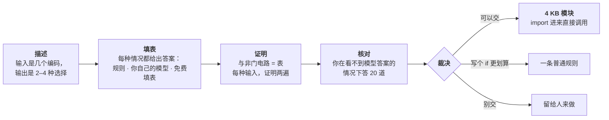

<div align="center">

# gatecraft

**把一个决策冻结下来，在每一种输入上证明它。**

[](https://gatecraft.fun)
[](LICENSE)


[](#接你自己的-agentmcp)

[English](README.md) · 中文


</div>

你的程序反复做同一个小决定——批还是不批、留还是删、重试还是放弃——而且每次都去问大模型。大约四分之一的时候它答得不一样，每次调用都要花钱，而且谁也说不清它为什么这么判。

**gatecraft 把你的程序可能遇到的每一种情况都提前问一次**，把答案编译成一颗与非门电路，在每一种输入上证明它——用两套独立的方法证明两遍——再让**你**盲答其中二十种来核对，最后交给你一个文件：

```js
import { decide } from "./refund-call.decision.mjs";   // 4 KB，零依赖，不联网

const { action, review } = decide({ age: 0, condition: 1, reason: 0, history: 0, price: 1 });
if (review) handToAPerson(); else actOn(action);
```

| | 每次都问模型 | 用 gatecraft 冻结之后 |
|---|---|---|
| 同一个输入问两遍 | **25%** 的时候答案不一样（实测） | 永远同一个答案 |
| 有没有验证 | 从来没有 | 每一种输入，都被两套独立的证明核过 |
| 每次调用的成本 | token、延迟，偶尔还宕机 | **零**——就是查一张表 |
| 拿不准的时候 | 照样给你一个答案 | **交给人处理**（`review: true`） |

## 看它怎么运行

选一种情况，被证明过的电路就会作出判断——传 1 的线会亮起来。没人定义过含义的编码，会落到安全的回答上并交给人，这是由构造保证的：

<p align="center"></p>

## 试一下

**在浏览器里**——打开 [**gatecraft.fun**](https://gatecraft.fun)。不用安装，不用注册。点「两分钟导览」，它会带着你用一个真实的决策一步步走完整个流程。

<p align="center"></p>

**在你的电脑上**——需要 Node 20 或更高版本，不用安装任何依赖：

```
git clone https://github.com/BruceLanLan/gatecraft && cd gatecraft
npm run ui                        # http://127.0.0.1:4747
```

**在你的 agent 里**——见下面的 [MCP](#接你自己的-agentmcp)。

## 它怎么工作



1. **描述**：把决策写成一份 *codebook*——它要看哪几样东西，每样分成几个编码、每个编码配一句人话；以及它能做的 2–4 种选择。其中一个是**安全**选择：万一被误执行，造成损害最小的那个。没配人话的编码是非法的，永远交给人。不想手写？用一句话描述这个决策，让你自己的模型起草。
2. **填表**：每一种合法情况都给出答案（通常几百种）。
3. **证明**：这张表被编译成与非门，在每一种输入上和表逐一核对，再由 [Yosys](https://github.com/YosysHQ/yosys) 用 miter 加 SAT 独立证明一遍。
4. **核对**：证明只能说明电路和表一致；这张表是不是你想要的，只有你能判断。你在**看不到模型答案**的情况下回答二十种情况：

   

5. **裁决**：你的答案用来扫描把握度门槛，给出三种结论之一：**可以交**（在这个门槛下，它决定这一部分，其余交给人）、**写个 if 更划算**（一条普通规则就能做到）、或者**别交**：

   

   *上图：refund-call 由决策模型填表，再对照 20 道盲答校准。这些盲答写于看到任何一个模型答案之前——答题的是一个作为独立判断者的 AI，还没有真人答过。*

6. **交付**：下载这个模块。里面装的是被证明过的那张表，文件头写明有没有人核对过。

## 没有 key 也能填表

| | 需要什么 | 适合 |
|---|---|---|
| **免费填表** | 什么都不用——每个地址 3 次，项目方付费 | 用校准过的模型把整个流程走一遍 |
| **规则** | 什么都不用，免费、确定 | 本来就能写成 if 的决策（裁决通常也会告诉你：就这么办） |
| **你自己的模型** | 你在页面上配好的模型，或者通过 MCP 接入的 agent | 所有人，记在自己的账上 |
| **Jev** | 免费注册一个 [typesafe.ai](https://typesafe.ai) 的 key——新账号**送 5 美元免费额度**，大约够做 500 个决策 | 想要校准得最好的把握度 |

用你自己的模型时，每种情况会**问三遍**，把握度是三次答案一致的比例——实测对话模型自报的把握度没有信息量，而三次全一致的行，重跑时 96%–98% 答案不变。开始之前会先告诉你要调用多少次。gatecraft 自己从不调用模型，也不内置任何 key；免费填表是唯一的例外，由 `trial.gatecraft.fun` 上的一个小服务转发，它只存每个地址的次数，而且地址先做了哈希（设置 `GATECRAFT_TRIAL=off` 可以关掉）。要用你自己的 Jev key：在 [console.typesafe.ai](https://console.typesafe.ai/) 注册登录，到 [console.typesafe.ai/keys](https://console.typesafe.ai/keys) 创建一个 key；在网站上直接粘贴到第 2 步里（key 只留在你的浏览器里，调用只经过转发、不保存），本机运行则用 `printf '%s' 'KEY' > ~/.config/gatecraft/jev.token`。页面上有分步引导。

### 让 key 只经过你自己的服务器

这个决策模型不接受网页直接调用，所以在网站上用你自己的 key 时，调用要经过一个转发服务——它只转发、不保存任何东西，默认用 gatecraft 的。如果你希望 key 只经过自己的服务器，有两个办法：

- **部署你自己的转发服务**（一个免费 Cloudflare 账号，点一下就行），然后在第 2 步「改用你自己的」里粘贴它的地址：

  [](https://deploy.workers.cloudflare.com/?url=https://github.com/BruceLanLan/gatecraft/tree/main/forwarder)

- 或者**在你自己的电脑上运行 gatecraft**（`npm run ui`，或者下面的 MCP）：key 会从你的电脑直接发给模型，不经过任何转发服务。

## 接你自己的 agent（MCP）

```
claude mcp add gatecraft -- node /path/to/gatecraft/scripts/mcp.mjs --out ./gatecraft-out
```

其它客户端：`{ "mcpServers": { "gatecraft": { "command": "node", "args": ["/path/to/gatecraft/scripts/mcp.mjs", "--out", "./gatecraft-out"] } } }`。然后跟 agent 说：「用 gatecraft 把我们代码里自动退款那个判断冻结下来。」

| 工具 | 做什么 |
|---|---|
| `gatecraft_decision_review` | 把决策读回成人话，并列出要检查的地方 |
| `gatecraft_decision_situations` | 列出所有情况，让 agent 来答 |
| `gatecraft_decision_fill` | 填表、冻结、证明——`rule`、`answers`（agent 自己的答案）或 `jev` |
| `gatecraft_decision_anchors` | 抽出二十道题——**给你答**，不是给 agent 答 |
| `gatecraft_decision_calibrate` | 用你的答案扫描门槛 |
| `gatecraft_decision_decide` | 在被证明的电路上跑一种情况 |
| `gatecraft_decision_export` | 把模块写进你的项目 |

锚点是给人答的：校准时会记录是谁答的，agent 答的在所有地方都被标成「一致性检查」，包括模块的文件头。模型的答案不经过 agent 的上下文——工具之间传的是目录，不是那张表。所有写入都限制在 `--out` 之内。

## 命令行

```
node scripts/decide.mjs draft     --from "一句话说清这个决策" --out out/d
node scripts/decide.mjs fill      --spec out/d/d.decision.json --with rule|chat|jev --out out/d
node scripts/decide.mjs freeze    --spec … --out out/d && node scripts/decide.mjs check --out out/d
node scripts/decide.mjs ask       --spec … --out out/d            # 二十道盲答
node scripts/decide.mjs calibrate --spec … --out out/d --anchors out/d/anchors.answered.json
node scripts/decide.mjs export    --spec … --out out/d
```

## 适不适合你？

**适合**：同一个小决策每天要做很多次；它要看的东西本来就是几档（等级、状态、分好桶的数字）；你说得出它能做的 2–4 种选择；而且错向一边比错向另一边更糟。

**不适合**：需要读文字、认人、看时间、或者调用别的服务——把原始值分成编码是你的程序的事，gatecraft 不跨过这堵墙。也不适合要看的东西太多（超过 16 位），多到任何人都没法有意义地抽二十个来核对。

## 我们测了什么

上面每个数字都来自一次有日期的实验，对我们不利的结论也一起写出来了——见 [docs/findings.zh-CN.md](docs/findings.zh-CN.md)。简单说：

- 同一个情况问模型两遍，只有 **75%** 的时候答案一样。
- 在测过的两个决策上，按「问三遍的一致率」计分，都比用模型自报的把握度好。
- 300 条人们随口许的愿望里，只有 **3%** 装得进电路——所以 gatecraft 服务的是程序里的一个决策，不是「描述任何东西」。
- 55 个真实决策里，只有 **15%** 落在它划算的范围。谁需要它，目前还没有证据。
- 6 个决策里有 2 个，填表模型在它最有把握的地方也和盲答不一致，而所有证明和检查都通过了。**要说明：**那些盲答是一个作为独立判断者的 AI 写的，还没有真人答过。

## 文档

- [工作原理](docs/method.zh-CN.md)：每一步做什么、保证什么、不保证什么。
- [实测结论](docs/findings.zh-CN.md)：设计背后的实验。
- [编译器参考](docs/compiler.zh-CN.md)：表达式程序、四种编辑器、本机 API、产物文件、状态电路、未签名流片单。「一句话变电路」工作台和画廊也都还在应用里。

## 开发

```
npm test          # 全部测试，在每个输入空间上穷举
```

`npm run setup` 和 `npm run check` 是维护者的发布闸（中性的 git 身份，以及用一份私有词表做扫描）；使用或参与 gatecraft 都不需要它们。

## 致谢

**ncd2net**（[@zhuoning293](https://x.com/zhuoning293)）把 Attention、FFN、Transformer 经定点 IR、Verilog、Yosys/ABC 编成纯与非门电路，并穷举验证。gatecraft 的第二套独立证明——把规格写成 BLIF，让 Yosys 证明电路与之相等（`src/boolean-ir.mjs`）——就是看到它之后定下来的。ncd2net 把**模型**降成电路，gatecraft 把**判断**降成电路。

## 许可证

[MIT](LICENSE) © BruceLanLan
