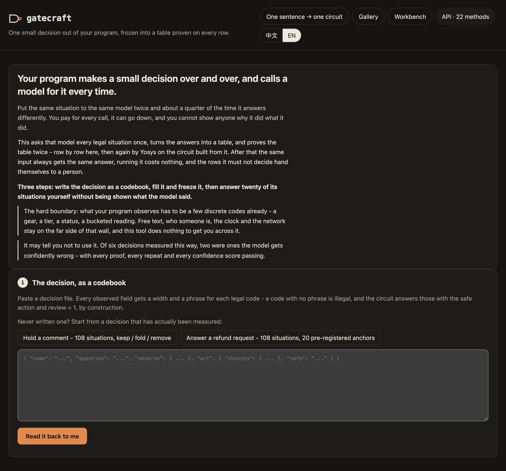
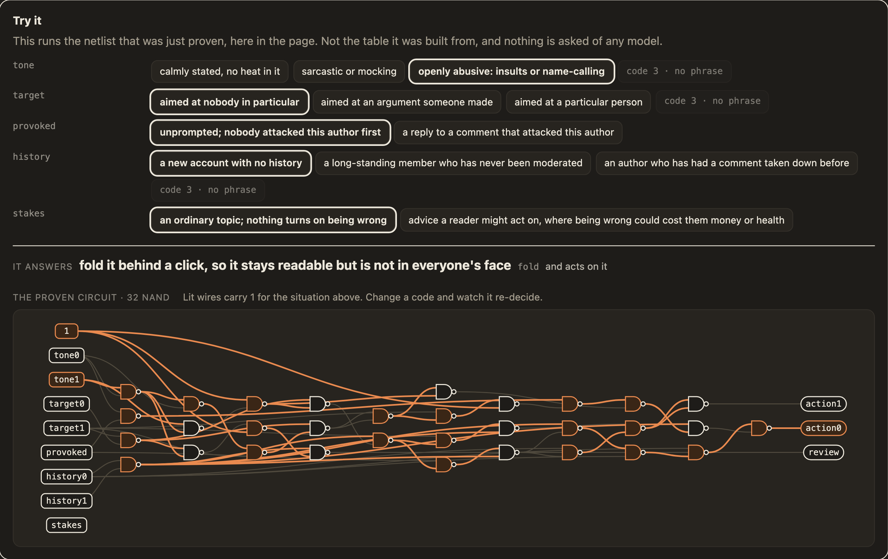
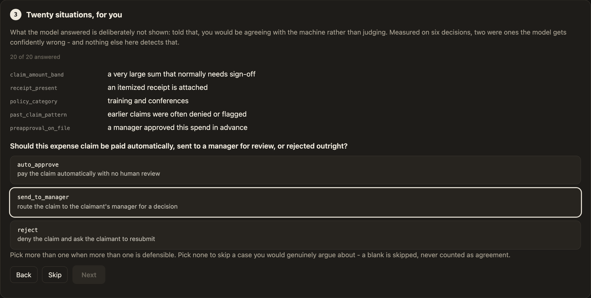
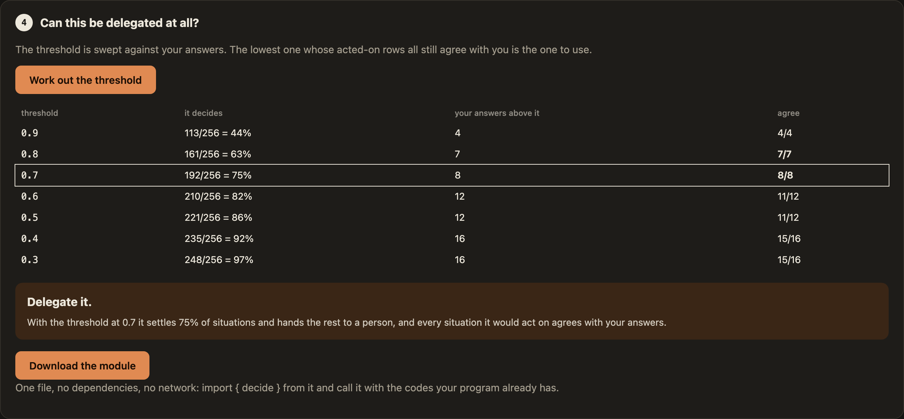

# gatecraft

[English](README.md) · 中文

**你的程序反复做同一个小决策，而现在每做一次就调一次模型。**大约四分之一的时候它答得不一样，每次调用都要花钱，而且你没法向任何人解释它为什么这么判。

gatecraft 把这个决策冻结下来：你的程序可能遇到的每一种情况都提前答一次；把这些答案做成与非门电路，逐行证明、而且用两套独立的方法证明两遍；再问**你**二十道题，确认这些答案真的是你想要的；最后交给你一个 4 KB、零依赖的文件，`import` 进来就能用：

```js
import { decide } from "./refund-call.decision.mjs";
const { action, review } = decide({ age: 0, condition: 1, reason: 0, history: 0, price: 1 });
if (review) handToAPerson(); else actOn(action);
```

| | 每次调模型 | 用 gatecraft 冻结之后 |
|---|---|---|
| 同一个输入 | **25%** 的时候答案不一样（实测） | 永远同一个答案 |
| 有没有验证 | 没有 | 每一行都被两套独立的证明核过 |
| 每次调用成本 | 按 token 付费 | **零** |
| 它拿不准时 | 照样给你一个答案 | **自己举手**（`review = 1`），交给人 |

**它还可能告诉你：别用它。**这样检查过的六个真实决策里，有两个是填表模型在最有把握的地方也和盲答不一致——而这两个都通过了逐行证明、独立证明、重跑一致和高把握度。只有那二十道盲答抓住了它，所以这一步是闸，不是可选项。要老实说明一点：那些盲答是由一个 AI 助手作为独立判断者写的，还没有真人答过——所以它说明的是这道检查能抓住什么，还不能说明按人的标准模型错得有多频繁。

## 它长什么样

`npm run ui` 打开就是这一页。可以从实测过的例子开始，也可以贴一份决策文件，或者用一句话描述这个决策，让你自己的模型起草。



表填好、证明完之后，可以直接上手点它。跑的是刚刚被证明的那份网表，一个门一个门地画出来，按你选的情况点亮：



然后是二十种情况，**不显示模型的答案**——看了答案，你就是在附和机器，而不是在判断：



你的答案决定裁决：**可以交**、**写个 if 更划算**，或者**别交**。



## 三分钟试一下

需要 Node 20 或更高版本。不用安装任何东西——它没有依赖。

```
git clone https://github.com/BruceLanLan/gatecraft && cd gatecraft
npm run ui                        # 打开 http://127.0.0.1:4747
```

依次点「Hold a comment」、「Read it back to me」，然后点「填表并冻结」（用掉 3 次免费填表中的一次，用的是校准过的模型），或者点「用文件里那条规则填」（永久免费）。两条路都不用 key、不用注册任何账号，而且后面每一步都是真的：证明、能上手点的电路、二十道盲答、裁决和下载。

## 三种填表方式

每一种合法情况都要答一次。手上有哪种就用哪种：

| | 需要什么 | 适合 |
|---|---|---|
| **免费填表** | 什么都不用——**每个地址 3 次**，项目方付费 | 注册任何东西之前，先用校准过的模型把整个流程走一遍 |
| **规则** | 什么都不用，免费、确定 | 本来就能写成 if 的决策（裁决通常也会告诉你就这么办） |
| **你自己的模型** | 你在页面上配好的模型，或者通过 MCP 接入的 agent | 所有没有决策模型账号的人 |
| **Jev**（可选） | 免费注册一次 [typesafe.ai](https://typesafe.ai)；一个决策约 1 美分 | 想要校准得最好的把握度 |

用你自己的模型时，每种情况会**问三遍**，把握度是三次答案一致的比例——实测对话模型自报的把握度没有信息量，而三次全一致的行，重跑时 96%–98% 答案不变。开始前按钮上会写明要调用多少次，请求从你的浏览器直接发到你的服务商，花的是你自己的账。

免费填表是「谁用模型谁付钱」的唯一例外：这台机器上没有 key 时，填表会经过 `trial.gatecraft.fun` 上的一个小服务，由它用项目方的 key 转发给同一个模型，那个 key 不会离开这个服务。它只存每个地址的次数，而且地址先做了哈希。3 次用完后，页面会引导你用另外三种方式。设置 `GATECRAFT_TRIAL=off` 可以关掉它。

除此之外，gatecraft 自己从不调用模型，也从不替你付钱；仓库里不带任何人的 key。要用你自己的 Jev key，把它写在只有这台机器能读到的地方：

```
mkdir -p ~/.config/gatecraft && printf '%s' '你的key' > ~/.config/gatecraft/jev.token && chmod 600 ~/.config/gatecraft/jev.token
```

## 接你自己的 agent（MCP）

如果你已经在用 Claude Code、Codex 或其他支持 MCP 的 agent，就不需要打开页面。gatecraft 可以作为 MCP 服务器运行，提供七个工具：

```
claude mcp add gatecraft -- node /path/to/gatecraft/scripts/mcp.mjs --out ./gatecraft-out
```

其他客户端，在它们的配置里写同样的东西：

```json
{ "mcpServers": { "gatecraft": { "command": "node", "args": ["/path/to/gatecraft/scripts/mcp.mjs", "--out", "./gatecraft-out"] } } }
```

然后跟 agent 说类似「用 gatecraft 把我们代码里自动退款那个判断冻结下来」。

| 工具 | 做什么 |
|---|---|
| `gatecraft_decision_review` | 检查决策文件，读回成人话，并列出要你看的地方 |
| `gatecraft_decision_situations` | 列出所有合法情况，让 agent 来答 |
| `gatecraft_decision_fill` | 填表、冻结、证明（装了 Yosys 会再证一遍）：`rule`、`answers`（agent 自己的答案）或 `jev` |
| `gatecraft_decision_anchors` | 抽出二十道题——**给你答**，不是给 agent 答 |
| `gatecraft_decision_calibrate` | 用你的答案扫门槛，给出裁决 |
| `gatecraft_decision_decide` | 在被证明的电路上跑一种情况 |
| `gatecraft_decision_export` | 把零依赖的模块写进你的项目 |

有两点是刻意这样设计的。**二十道锚点必须由人来答：**工具说明里写明了，校准会记录是谁答的，agent 答的锚点在所有地方都被标成「一致性检查」，包括导出模块的头部。**模型的答案不经过 agent 的上下文：**工具之间传的是目录，不是那张表，所以 agent 问你问题时不会把答案说漏。所有写入都限制在 `--out` 之内。

## 命令行

同样的流程，一步一步来：

```
node scripts/decide.mjs draft     --from "一句话说清这个决策" --out out/d
node scripts/decide.mjs fill      --spec out/d/d.decision.json --with rule|chat|jev --out out/d
node scripts/decide.mjs freeze    --spec … --out out/d && node scripts/decide.mjs check --out out/d
node scripts/decide.mjs ask       --spec … --out out/d            # 二十道盲答
node scripts/decide.mjs calibrate --spec … --out out/d --anchors out/d/anchors.answered.json
node scripts/decide.mjs export    --spec … --out out/d            # 那个 4 KB 的模块
```

## 装之前先看这几条

- **观测必须本来就是几个离散编码**——档位、等级、状态、分好桶的读数。需要读文字、认人、联网或看时钟的，都在这个工具不跨过的那堵墙的另一侧；把原始值分成编码是你的程序的事。
- **决策能做多大，取决于人能抽查多少**，不取决于电路。上限是 16 位。
- **谁需要这个东西，目前没有证据。**实测的 55 个真实决策里，只有 **15%** 落在它划算的范围——写不出一条短规则，**而且**模型能定下大部分情况——而且这是上界。
- 一句话变电路的工作台和画廊都还在，留给真的就那么小的电路。实测 300 条人们随口许的愿望里，这样的只有 **3%**。
- 未签名流片单**从来没有真正签过一笔**，只在链上做过只读验证。

这一页的每个数字都来自 [docs/findings.zh-CN.md](docs/findings.zh-CN.md) 里有日期的测量。

## 文档

- [工作原理](docs/method.zh-CN.md)：codebook、三种填表方式、两套证明、锚点、校准和导出，以及每一步为什么这样设计。
- [实测结论](docs/findings.zh-CN.md)：设计背后的实验，包括对我们不利的那些。
- [编译器参考](docs/compiler.zh-CN.md)：表达式程序、四种编辑器、本机 API、产物文件、宽表、状态电路、流片单。

## 开发

```
npm test          # 全部测试，在每个输入空间上穷举
```

`npm run setup` 和 `npm run check` 是维护者的发布闸：它们强制中性的 git 身份，并用一份不在仓库里的私有词表做扫描。使用或参与 gatecraft 都不需要它们。

## 致谢

**ncd2net**（[@zhuoning293](https://x.com/zhuoning293)）把 pyncd 描述的 Attention、FFN、Transformer 经定点 IR、Verilog、Yosys/ABC 编成纯与非门电路——Attention Core 1,024 个与非门，在 2²⁴ 种输入上穷举验证，零错误。gatecraft 的第二套独立证明（把规格写成 BLIF，让 Yosys 用 miter 加 SAT 证明电路与之相等，`src/boolean-ir.mjs`）就是看到它之后定下来的：在那之前只有我们自己的一套证明。两者做的事不同——ncd2net 把**模型**降成电路，gatecraft 把**判断**降成电路——但落在同一块地基上。

## 许可证

[MIT](LICENSE) © BruceLanLan
